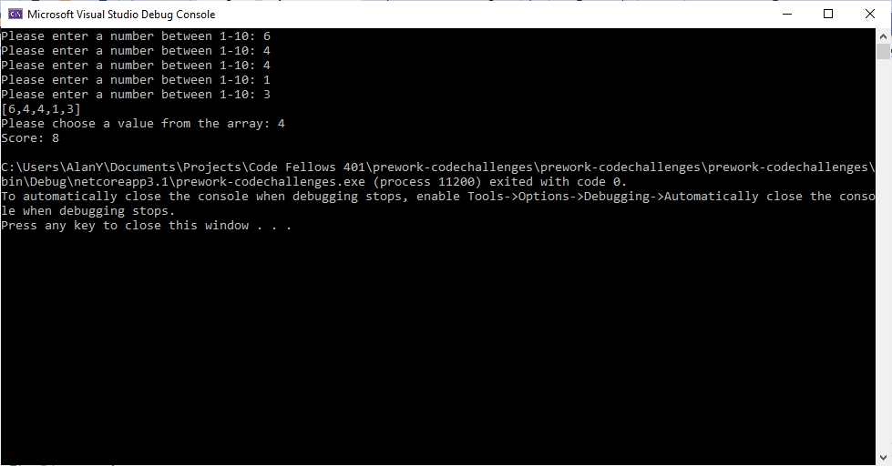
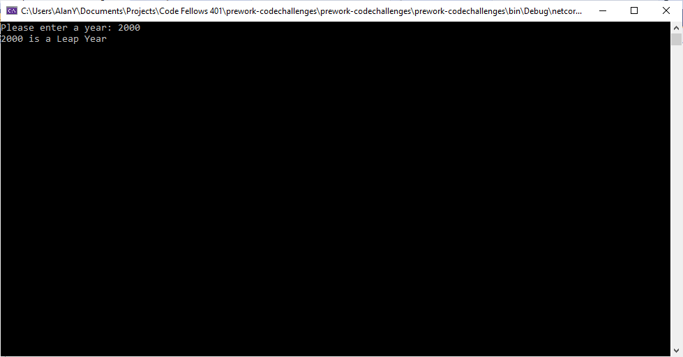
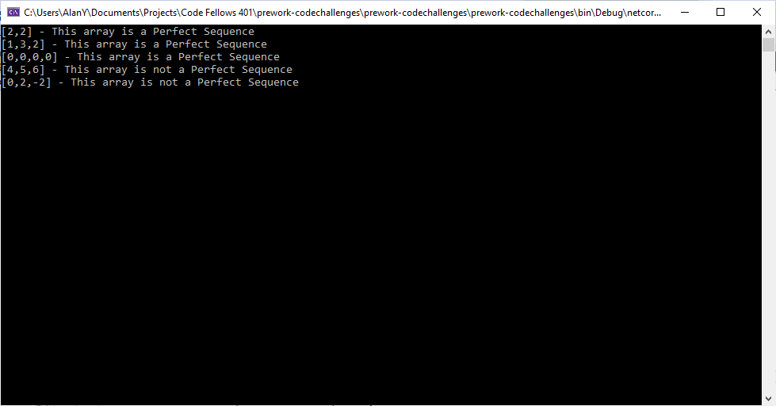
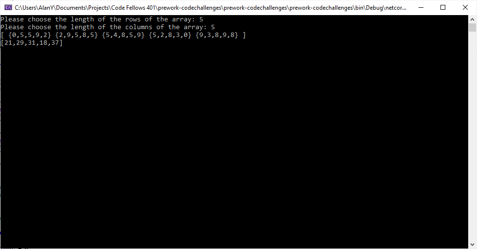

# Pre-work Code Challenge

<br>
<br>

## Name: Array Max

### Instructions
Given an array select a number that exists, and output the computated “score”. The method you create should take in both an array of integers and the integer the user selected.

Create a Console application that requests 5 numbers between 1-10 from the user. Output the array to the console and ask the user to select a number. After the selection, output the “score” of the number chosen.

### Output


<br>

## Name: Leap Year

### Instructions
Given a year, report if it is a leap year.

```
on every year that is evenly divisible by 4
  except every year that is evenly divisible by 100
    unless the year is also evenly divisible by 400
```

### Output


<br>

## Name: Perfect Sequence

### Instructions
Given an array, return “Yes” if the sequence is considered a perfect sequence. Otherwise, return “No”

A perfect sequence is a sequence such that all of its elements are non-negative integers and the product of all of them is equal to their sum. For example: [2,2], [1,3,2] and [0,0,0,0] are perfect sequences and [4,5,6] and [0,2,-2] are not perfect sequences. Negative numbers of any kind are not valid in a perfect sequence

### Output


<br>

## Name: Sum of Rows

### Instructions
Given a matrix of integers. Return the sum of each row in a single dimensional array.

### Output

